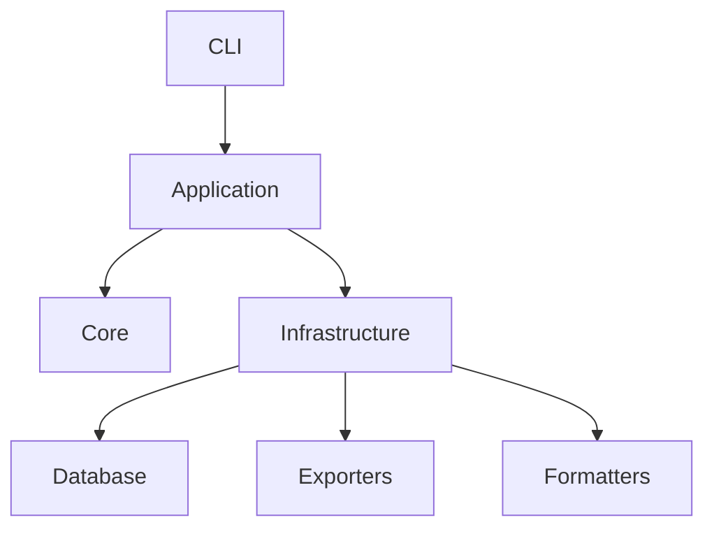

# 🗃️ Scavengr


> _"Descubre lo que tus bases esconden."_

**Scavengr** es una herramienta de línea de comandos para extraer, validar y documentar metadatos de bases de datos con **inteligencia automática** 🧠✨

---

## 🚀 Características Principales

### 🔍 Extracción de Metadatos

- **Múltiples motores**: PostgreSQL, MySQL/MariaDB y SQL Server
- **Extracción completa**: Tablas, columnas, tipos de datos, relaciones, índices
- **Formato DBML**: Compatible con [dbdiagram.io](https://dbdiagram.io)
- **Configuración simple**: Archivo `.env` para credenciales

### 📊 Diccionarios de Datos

- **Formato Excel**: 19 campos especializados por columna
- **Análisis de sensibilidad**: Clasificación automática
- **Descripciones inteligentes**: 80+ patrones de detección
- **Observaciones contextuales**: Warnings y recomendaciones

### ✅ Validación de Esquemas

- **Validación exhaustiva**: Sintaxis, estructura y consistencia
- **Detección de errores**: Tablas, relaciones, claves
- **Análisis de integridad**: Referencias y relaciones
- **Validaciones de calidad**: CamelCase, tipos, índices

### 📈 Reportes Analíticos

- **Score de calidad**: 7 dimensiones evaluadas
- **Análisis estadístico**: Tipos, tamaños, relaciones
- **Recomendaciones**: Priorizadas por impacto
- **Formato Excel**: 5 hojas detalladas

---

## ⚡ Inicio Rápido

```bash
# Instalación
pip install scavengr

# Configuración
scavengr init

# Uso básico
scavengr extract -o schema.dbml
scavengr validate -i schema.dbml
scavengr dictionary -i schema.dbml -o dict.xlsx
scavengr report -i schema.dbml -o report.xlsx
```

---

## 📚 Documentación

- **[Instalación](guide/installation.md)**: Guía de instalación detallada
- **[Configuración](guide/configuration.md)**: Configuración de credenciales
- **[Comandos CLI](guide/commands.md)**: Referencia completa de comandos
- **[API Reference](api/core/entities.md)**: Documentación del código

---

## 🏗️ Arquitectura

Scavengr implementa **Clean Architecture** con separación clara:



- **Core**: Entidades de dominio, interfaces y servicios
- **Application**: Casos de uso (extract, validate, dictionary, report)
- **Infrastructure**: Conectores de BD, exportadores, formateadores
- **CLI**: Interfaz de línea de comandos

---

## 🤝 Contribuir

¿Quieres contribuir? Consulta nuestra [guía de contribución](contributing.md).

---

## 📝 Licencia

MIT License - ver [LICENSE](https://github.com/JasRockr/Scavengr/blob/main/LICENSE)
